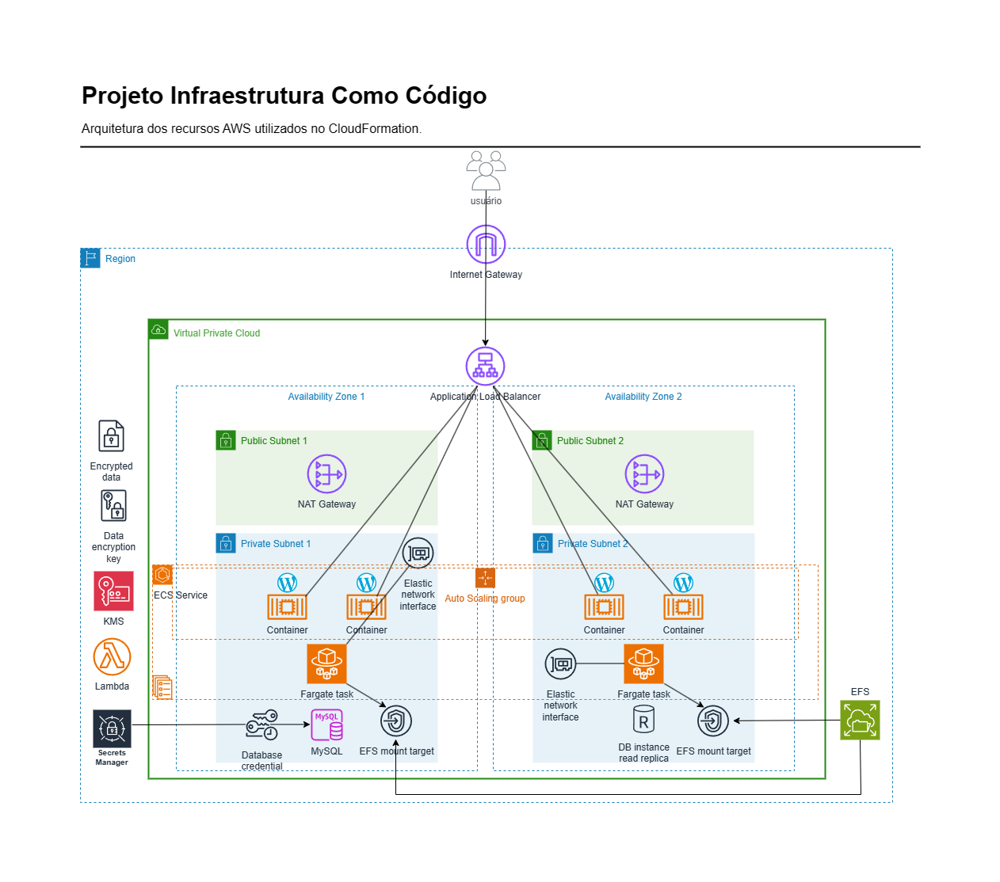

# Projeto Infra as Code

## CloudFormation WordPress

ECS FARGATE EFS RDS SECRETSMANAGER KMS LAMBDA LOADBALANCER AUTOSCALING VPC SUBNETS

## DEPLOY

### AWS Console

Utilizando o console da AWS faça o upload do arquivo ecs-wordpress-stack.yml no CloudFormation para iniciar o provisionamento dos recursos.
Você também pode seguir esse tutorial da AWS: [CloudFormation Guia do Usuário](https://docs.aws.amazon.com/pt_br/AWSCloudFormation/latest/UserGuide/cfn-console-create-stack.html)

Parametros a serem definidos pelo usuario:

      DatabaseInstanceClass:
        Instancia EC2 que deve ser usada para o banco de dados.
      DatabaseAllocatedStorage:
        Quantidade de armazenamento (em gigabytes) que deve ser alocada para o banco de dados.
      DatabaseMaxAllocatedStorage:
        Quantidade máxima (em gigabytes) que o Amazon RDS pode dimensionar automaticamente o armazenamento do banco de dados.
      DatabaseBackupRetentionPeriod:
        Tempo que os backups automatizados do banco de dados devem ser mantidos.
      EnableDatabaseMultiAZ:
        Se o banco de dados deve ser implantado em diversas zonas de disponibilidade.
      EnableDatabaseReadReplica:
        Ativar uma replica de leitura.
      DatabaseCredentialsRotationSchedule:
        Frequencia em que as credenciais do banco de dados devem ser alteradas.
      EnableEFSAutomaticBackups:
        Ativar backup automatico dos dados do sistema de arquivos (EFS).
      ECSTaskvCPU:
        vCPU que a tarefa deve usar.
      ECSTaskMemory:
        Memoria que a tarefa deve usar.
      ECSLogRetentionPeriod:
        Tempo em que os logs de eventos devem ser retidos.
      ECSServiceAutoScalingMetric:
        Metrica a ser usada para auto scaling.
      ECSServiceAutoScalingTargetValue:
        Valor que a metrica deve usar para auto scaling, caso seja uso da cpu sera uma porcentagem de uso.
      ECSServiceAutoScalingTargetMinCapacity:
        Capacidade minima desejada para o auto scaling.
      ECSServiceAutoScalingTargetMaxCapacity:
        Capacidade maxima desejada para o auto scaling.
